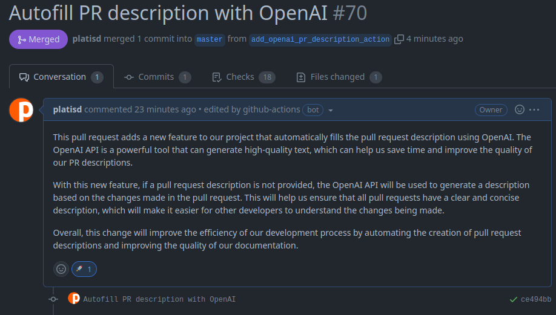
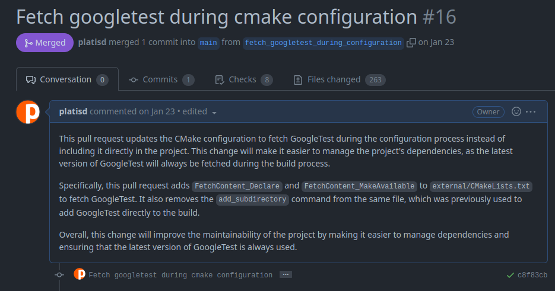
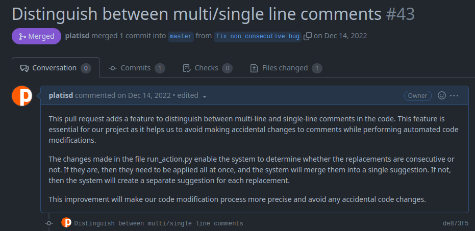

# `platisd/openai-pr-description` GitHub Action

Autofill the description of your pull requests with the power of OpenAI!



## What does it do?

`platisd/openai-pr-description` is a GitHub Action that looks at the title as well as the contents
of your pull request and uses the [OpenAI API](https://openai.com/blog/openai-api) to automatically
fill up the description of your pull request. Just like ChatGPT would! 🎉<br>
The Action tries to focus on **why** the changes are needed rather on **what** they are,
like any proper pull request description should.

The GitHub Action will only run when a PR description is not already provided.
In other words it will not accidentally overwrite your existing description.
The idea is this Action will save you the time and trouble of writing **meaningful** pull request descriptions.<br>
You can customize it in different ways. One of them allows the Action to only run on pull requests started
by specific users, e.g. the main maintainers of the repository.
Keep in mind the OpenAI API is not free to use. That being said, so far it's been rather cheap,
i.e. around ~$0.10 for 15-20 pull requests so far.

## How can you use it?

1. Create an account on OpenAI, set up a payment method and get your [OpenAI API key].
2. Add the OpenAI API key as a [secret] in your repository's settings.
3. Create a workflow YAML file, e.g. `.github/workflows/openai-pr-description.yml` with the following contents:

```yaml
name: Autofill PR description

on: pull_request

jobs:
  openai-pr-description:
    runs-on: ubuntu-22.04

    steps:
      - uses: platisd/openai-pr-description@master
        with:
          github_token: ${{ secrets.GITHUB_TOKEN }}
          openai_api_key: ${{ secrets.OPENAI_API_KEY }}
```

| Input             | Description                                           | Required | Default                    |
| ----------------- | ----------------------------------------------------- | -------- | -------------------------- |
| `github_token`    | The GitHub token to use for the Action                | Yes      |                            |
| `openai_api_key`  | The [OpenAI API key] to use, keep it hidden           | Yes      |                            |
| `pull_request_id` | The ID of the pull request to use                     | No       | Extracted from metadata    |
| `openai_model`    | The [OpenAI model] to use                             | No       | `gpt-3.5-turbo`            |
| `max_tokens`      | The maximum number of **prompt tokens** to use        | No       | `1000`                     |
| `temperature`     | Higher values will make the model more creative (0-2) | No       | `0.6`                      |
| `sample_prompt`   | The prompt to use for giving context to the model     | No       | See `SAMPLE_PROMPT`        |
| `sample_response` | A sample response for giving context to the model     | No       | See `GOOD_SAMPLE_RESPONSE` |


[OpenAI API key]: https://help.openai.com/en/articles/4936850-where-do-i-find-my-secret-api-key
[OpenAI model]: https://platform.openai.com/docs/models
[secret]: https://docs.github.com/en/actions/security-guides/encrypted-secrets


## Demo

* [platisd/smartcar_shield/pull/70](https://github.com/platisd/smartcar_shield/pull/70)
  * The GitHub Action explained why it is useful to add itself to a repository. 🤯


* [platisd/cpp-command-parser/pull/16](https://github.com/platisd/cpp-command-parser/pull/16)
  * A decent explanation on why fetching `GoogleTest` during the `cmake` build instead of
  version controlling it, is a good idea. 🎯



* [platisd/clang-tidy-pr-comments/pull/43](https://github.com/platisd/clang-tidy-pr-comments/pull/43)
  * I would improve it a bit, some parts are a bit off, but with small modifications it'd better
  than the PR description I originally had. 😅



### `403` error when updating the PR description

If you get a `403` error when trying to update the PR description, it's most likely because
the GitHub Action is not allowed to do so.
The easiest way forward is to grant the necessary permissions to the `GITHUB_TOKEN` secret
at `<your_repo_url>/settings/actions` under `Workflow permissions`.
